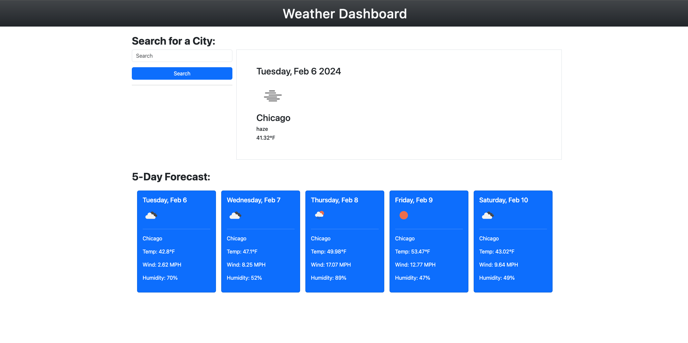

# Weather Dashboard

## Table of Contents

- [Overview](#overview)
- [Features](#features)
- [Usage](#usage)
- [Technologies Used](#technologies-used)
- [Authors](#authors)

## Overview

The Weather Dashboard is a web application that allows users to quickly check the current weather and a 5-day forecast for a selected city. Users can also save their favorite cities and easily access weather information for those locations.

## Features

- **Current Weather Display:** The application shows the current weather information, including temperature, description, and an icon representing the weather condition.

- **5-Day Forecast:** Users can view a 5-day forecast, displaying details such as date, temperature, wind speed, and humidity.

- **Search Functionality:** Users can search for weather information for any city by entering the city name in the search bar.

- **City Buttons:** The application dynamically generates buttons for cities that users have searched for. Users can click on these buttons to quickly view weather information for those cities.

- **Local Storage:** City buttons are stored in local storage, allowing users to retain their selected cities even when they reload the page.

## Usage

1. **Default City:** The default weather information is set to Chicago, but users can search for any city using the search bar.

2. **Search for a City:** Enter the name of a city in the search bar and click the "Search" button. The application will display the current weather and a 5-day forecast for the selected city.

3. **City Buttons:** After searching for a city, a button for that city will be dynamically created. Click on these buttons to quickly switch between cities.

4. **Local Storage:** The selected cities are saved in local storage. This means that even if you reload the page or close the browser, your selected cities will still be available.

## Technologies Used

- **HTML:** Structure of the web page.
- **CSS (Bootstrap):** Styling and layout of the application.
- **JavaScript (jQuery, Day.js):** Dynamic functionality and API interactions.
- **OpenWeatherMap API:** Fetches real-time weather data for the selected cities.

## Authors

- [plucafo](https://github.com/plucafo)

 

 

[Go to Top](#weather-dashboard)